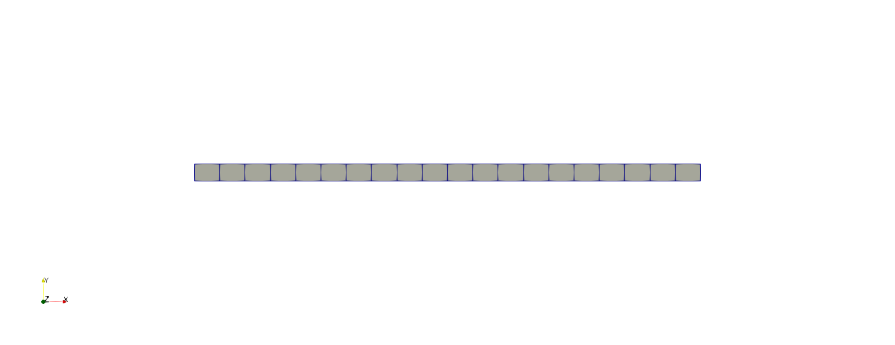

# Examples
The dune-elastodynamics module contains several examples for static and dynamic linear
elasticity cases.

## Example01
In this example, a slender cantilever beam is put under a unit load at the free end.
The overall displacement of the beam is calculated.

### Setup
<figure>
	

		
	

</figure>

### Calculation
The main new features are:
- setting up the necessary data structures
- generating the grid
- creating the function space basis tree
- assembling the problem and boundary conditions
- solving the linear system
- getting output for paraview

### Result
<figure>
	

		
	

</figure>

## Example02

## Example03
